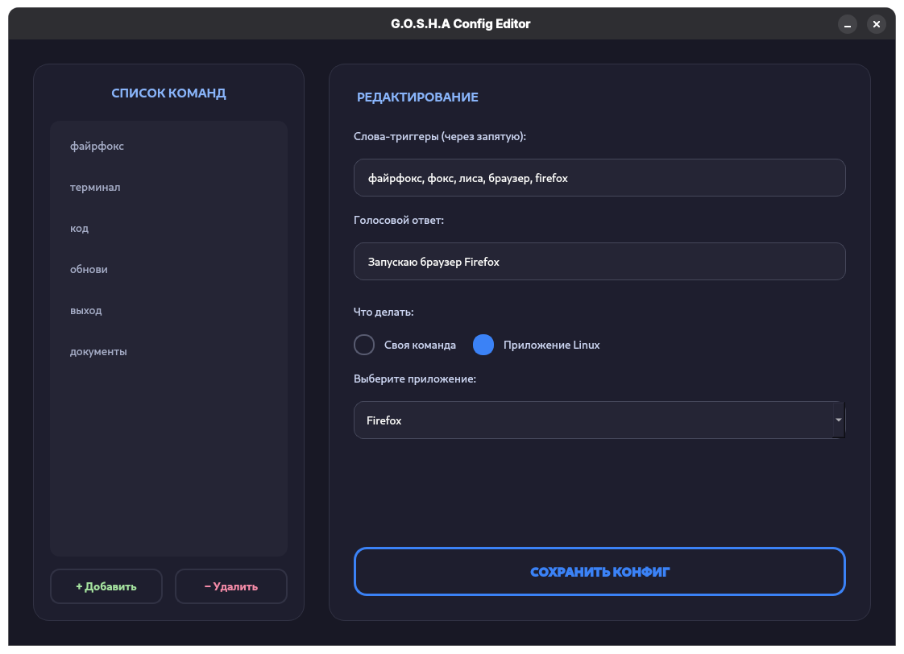

# L.I.S.A. — Linux Integrated Smart Assistant


Голосовой ассистент, работающий как фоновая служба (systemd). Проект разработан для участия в студенческой научно-практической конференции **«Технологии будущего: от идеи к реальности»** (Колледж программирования и кибербезопасности РТУ МИРЭА).

## Технические особенности

*   **Распознавание (STT):** Vosk (оффлайн, модель `small-ru`).
*   **Синтез речи (TTS):** Edge-TTS (онлайн, нейросетевой голос).
*   **Архитектура:** Python-скрипт, работающий как `systemd user service`.
*   **Управление:** Полная интеграция с системными вызовами Linux (bash, dnf/apt).

## Установка

Проект содержит скрипт автоматической настройки окружения и регистрации демона.

1. **Клонирование репозитория:**
   ```bash
   git clone https://github.com/ValterGames-Coder/L.I.S.A.git
   cd L.I.S.A
   ```

2. **Запуск установщика:**
   ```bash
   chmod +x install_lisa.sh
   ./install_lisa.sh
   ```

## Управление (Systemd)

Так как ассистент работает в фоне, управление производится через `systemctl`.

*   **Просмотр логов (что говорит и слышит бот):**
    ```bash
    journalctl --user -u L.I.S.A -f
    ```
    *(Нажмите `Ctrl+C` для выхода)*

*   **Проверка статуса:**
    ```bash
    systemctl --user status L.I.S.A
    ```

*   **Ручной запуск / Перезагрузка / Остановка:**
    ```bash
    systemctl --user start L.I.S.A
    systemctl --user restart L.I.S.A
    systemctl --user stop L.I.S.A
    ```

## Конфигурация

Список команд находится в файле `config.json`. После редактирования требуется перезапуск службы.

**Пример добавления команды:**
```json
{
    "triggers": ["код", "редактор"],
    "response": "Запускаю VS Code",
    "exec": "code"
}
```

Также для редактирования команд реализовано GUI-приложение, позволяющее менять настройки без ручной правки JSON.
Для запуска выполните:

```bash
python3 editor.py
```
